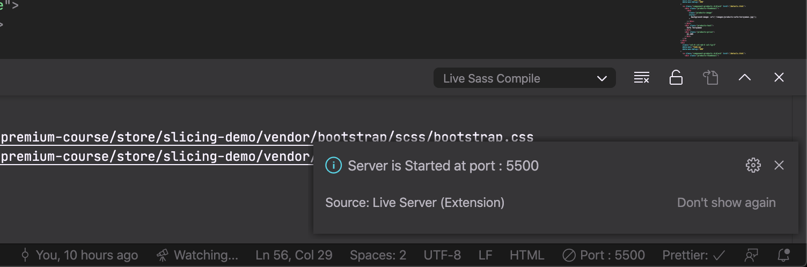

# Memulai Kelas

Selamat datang di dokumentasi BWAStore. Terima kasih telah membeli kelas BWAStore dari BelajarKoding dan BuildWith Angga. Support kalian untuk kami para creator sangat kami apresiasi. Karena tanpa support dari kalian, kami tetap bisa untuk membuat konten tutorial yang terbaik untuk kalian 😄

Pastikan kalian membeli kelas ini langsung dari creatornya ya 😉. Kami sangat sedih jika kalian membeli dari pihak yang tidak bertanggung jawab. Jika kalian mendapatkannya selain dari BelajarKoding dan BuildWith Angga, kalian bisa lapor langsung ke kami ya!

Sebelum memulai belajar, ada beberpa informasi yang akan kami akan update secara berkala di halaman ini, dan kalian bisa cek berkala. Di halaman ini pula kami akan mendokumentasikan tutorial yang memang membutuhkan catatan seperti pemasangan tools dan deployment server

People with the spirit of learning, lets start! 😉

# Visual Studio Code
Sebelum kalian memulai membuat aplikasi, saya rekomendasikan untuk memasang semua plugin dibawah ini. 

## Ekstensi
### Ekstensi PHP & Laravel
1. Laravel Blade Snippets
2. Laravel Blade Spacer
3. Laravel Model Snippet
4. Laravel Snippets
5. Laravel Extra Intellisense
6. Laravel goto view
7. laravel-goto-controller
8. PHP Docblocker
9. PHP Intelephense
10. PHP Namespace Resolver
11. PHP Awesome Snippets
12. PHPDoc Generator
13. DotENV

### Ekstensi Lainnya
1. Auto Complete Tag
2. Auto Close Tag
3. Auto Rename Tag
4. Bootstrap 4, Font awesome 4, Font Awesome 5 Free & Pro snippets
5. Better Align
6. Bracket Pair Colorizer 2
7. Icon Fonts
8. Prettier
9. GitLens
10. Version Lens
11. Error Lens
12. Live SASS Compiler
13. Live Server
14. SonarLint
15. IntelliSense for CSS class names in HTML
16. Vetur
 
## Tema & Font
### Tema
1. Absolute Black
2. Monokai Pro

### Font 
1. Operator Mono
2. JetBrains Mono

# Menjalankan Live Server 
Pada tutorial ini, saya menggunakan ekstensi Live Server dan Live SASS Compiler. Sebelum memulai slicing, pastikan kalian klik **GO Live** dan **Watch SASS** terlebih dahulu, dan pastikan bahwa file SASS kalian ter compile dengan cara mengecek file .css yang ada bersamaan dengan file .scss

Pastikan kalian selalu mengubah file .scss nya dan bukan .css nya, karena file .scss akan dicompile secara otomatis menjadi dan .css dan jika kalian menulis di file .css, maka perubahan kalian akan tertimpa.

# Instalasi Tools Untuk Laravel
Sebelum kamu dapat melanjutkan tahap Laravel, kamu dapat memasang tools di bawah ini sesuai dengan sistem operasi yang kamu gunakan

## Windows
Untuk sistem operasi Windows, tools yang direkomendasikan untuk membuat aplikasi PHP dan Laravel adalah Laragon. Pada laragon, kamu juga dapat memasang aplikasi tanpa harus melakukan instalasi lewat command line

1. Masuk ke website laragon.org lalu klik Download 
2. Pilih Laragon - Full 
3. Ikuti instalasi yang ada dari installernya
4. Jalankan Laragon
5. Klik Start All 
6. Klik “Menu” 
7. Pilih Quick App -> Laravel 
8. Masukkan nama project. Isi nama sesuai keinginan kalian 
9. Proses instalasi laravel akan dijalankan oleh laragon. Untuk URL nya akan bisa diakses setelah proses instalasi selesai. 
10. Untuk mengakses URLnya, kalian bisa membuka URL sesuai dengan nama project. 
11. Jika kalian membuat nama projectnya bwastore, maka kalian akses http://bwastore.test 
12. Kalian bisa langsung akses situs laravelnya. 
13. Kalian pun bisa akses lewat aplikasi laragonnya. 
14. Untuk membuka composer dan terminal, kalian bisa klik tombol Terminal yang ada di dalam aplikasi Laragon

## macOS
Untuk macOS, saya merekomendasikan untuk memakai Laravel Valet yang proses instalasinya dapat dibuka disini :
https://laravel.com/docs/6.x/valet

Jika tidak ingin menggunakan Laravel Valet, kalian bisa menggunakan MAMP untuk instalasi Tools nya yang dapat diunduh di
https://www.mamp.info/en/downloads/

Jika memakai MAMP, untuk composer nya harus dipasang terpisah dengan cara:
https://gist.github.com/kkirsche/5710272

## Linux
Untuk Linux, saya merekomendasikan untuk memakai Laravel Valet for Linux yang proses instalasinya dapat dibuka disini :
https://cpriego.github.io/valet-linux/

Jika tidak ingin menggunakan Laravel Valet, kalian bisa menggunakan XAMPP For Linux (LAMPP) untuk instalasi Tools nya yang dapat diunduh di
https://www.apachefriends.org/download.html

Sebagai alternatif, kamu bisa juga mengikuti tutorial di bawah ini jika ingin memasang secara manual:
https://www.linuxbabe.com/ubuntu/install-lemp-stack-nginx-mariadb-php7-2-ubuntu-18-04-lts

# Adminer

Adminer adalah tools untuk mengatur database MySQL di server kita. Saya merekomendasikan menggunakan Adminer karena ringan dan mudah untuk digunakan

Untuk adminer, saya merekomendasikan untuk menggunakan versi dari @pematon di GitHub, yang bisa kalian akses di https://github.com/pematon/adminer-custom

Proses instalasinya, cukup kalian download zip / clone dan kalian taruh di folder www (jika menggunakan Laragon)
